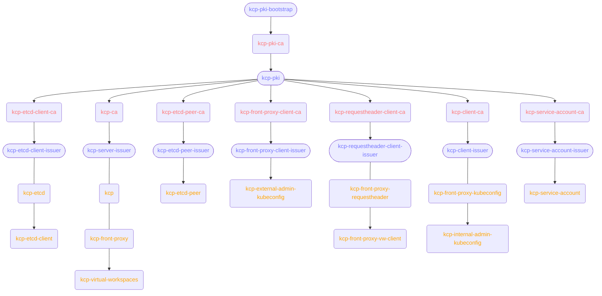

# pkiplot - Turn your cert-manager PKI into Mermaid Diagrams

pkiplot (pronounced _pikaplot_) is a small utility that reads [cert-manager](https://cert-manager.io/)
`Certificates`, `Issuers` and `ClusterIssuers` from YAML files and outputs a Mermaid diagram that describes
the entire PKI.

## Example: kcp

[kcp](https://www.kcp.io/)'s Helm chart sets up a less than trivial PKI in its Helm chart. If you render the
Helm chart and then convert it with pkiplot:

```
cd kcp-dev/helm-charts/charts
helm template --namespace kcp kcp ./kcp | pkiplot -n kcp -
```

… you receive this output:



## Installation

Either [download the latest release](https://github.com/xrstf/pkiplot/releases) or build for yourself using Go 1.20+:

```bash
go install go.xrstf.de/pkiplot
```

## Usage

Couldn't really be any simpler:

```bash
Usage of pkiplot:
      --cluster-resource-namespace string   cert-manager's cluster resource namespace, used to find secrets referenced by cluster-scoped objects (default "cert-manager")
  -f, --format string                       Output format (one of [mermaid]) (default "mermaid")
  -n, --namespace string                    Only include namespace-scoped resources in this namespace (also the default namespace for resources without namespace set)
  -v, --verbose                             Enable more verbose output
  -V, --version                             Show version info and exit immediately
```

## License

MIT
